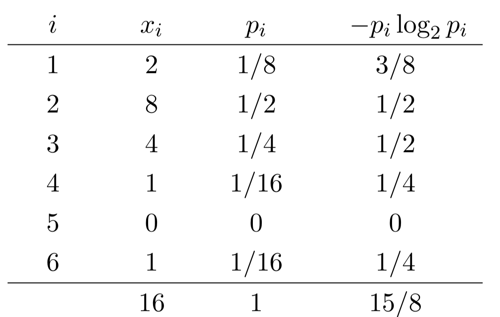

# Shannon Entropy Calculator

<blockquote>

</blockquote>

A Java program that calculates the Shannon entropy of discrete probability distributions.

## **Mathematical Definition**
For a sequence containing values 1 through m:

<p align="center">
  
</p>

Where:
- \( p_i \) = proportion of integers equal to i
- \( 0\log_2 0 \) is treated as 0

## **Usage**
1. **Compile** the program:
   ```bash
   javac ShannonEntropy.java
   ```
2. **Run** with integer argument and input:
   ```bash
   java ShannonEntropy m < input.txt
   ```
   - `m`: Maximum integer value in distribution
   - Input: Space-separated integers (1 to m)

## **Examples**
```bash
# Fair coin toss (50/50 distribution)
$ java ShannonEntropy 2 < fair-coin.txt
1.0000

# Loaded die roll (biased distribution)
$ java ShannonEntropy 6 < loaded-die.txt
1.8750
```

## **Implementation Details**
- Counts frequency of each integer (1 to m)
- Computes proportions (pᵢ = countᵢ/total)
- Calculates entropy using base-2 logarithms
- Handles edge cases (pᵢ = 0) properly
- Formats output to 4 decimal places

## **Interpretation**
- Maximum entropy (log₂m): Uniform distribution
- Lower entropy: More predictable distribution
- 0 entropy: All values identical

## **Applications**
- Measuring information content
- Evaluating randomness
- Feature selection in ML
- Data compression analysis
```
